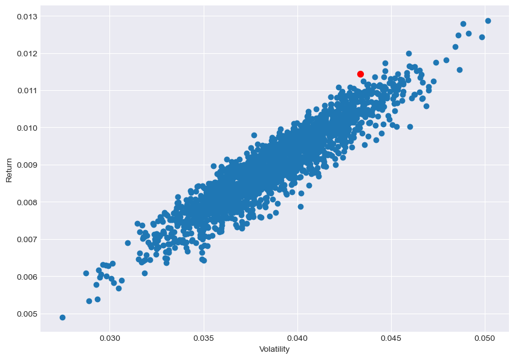
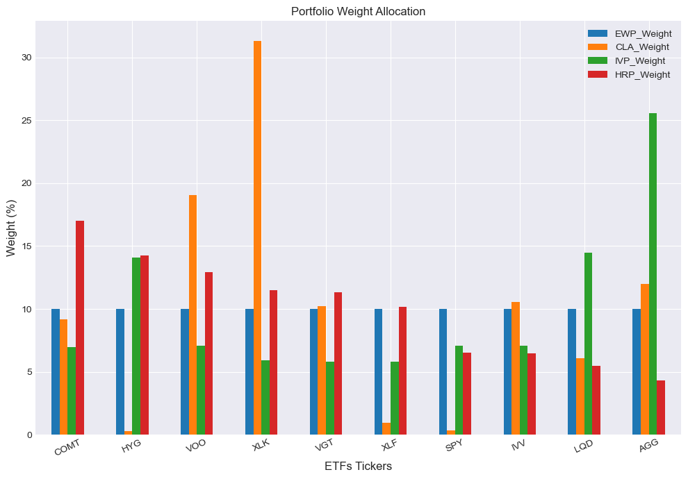
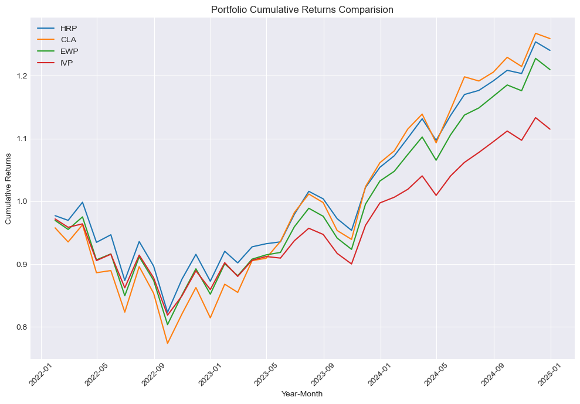
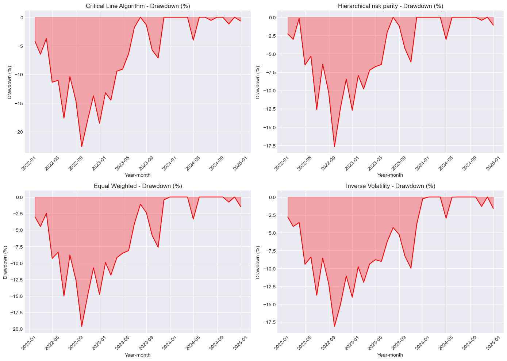

# Project Overview

This project explores industry-relevant portfolio management techniques, focusing on optimizing capital allocation across a diverse set of assets. After analyzing traditional methods such as the Equal wighted, the Critical Line Algorithm (a practical mean-variance optimization technique) and Inverse Volatility, the project shifts towards Hierarchical Risk Parity (HRP) portfolio optimization. HRP leverages machine learning, specifically unsupervised techniques like hierarchical clustering, to group similar assets and enhance diversification by minimizing portfolio risk. 

This repository provides a detailed analysis, code, and insights into constructing efficient portfolios.

# Table of Contents
1. [Introduction](#introduction)
2. [Data Acquisition](#data-acquisition)
3. [Data Preprocessing](#data-preprocessing)
4. [Defining Features And Filter Data](#defining-features-and-filter-data)
5. [Portfolio Construction and Weight Allocation](#portfolio-construction-and-weight-allocation)
6. [Performance Analysis](#performance-analysis)
7. [Conclusion](#conclusion)

## <a id="introduction"></a> Introduction


The major aim of portfolio construction is to diversify capital allocation to increase returns and control risk. Focusing our capital in one sector or a few assets, due to correlation, might lead to a significant drawdown in our investments. In this notebook, we will develop a systematic and data-driven approach to construct well-diversified portfolios by focusing on risk  and diversification.

We will construct portfolios and allocate assets by using four different techniques that are heavily utilized in quantitative finance. We will utilize 24 ETFs, representing a diverse range of actively traded industries and sectors. Initially, we will filter these down to 10 ETFs based on historical data from 2018 to 2022, considering factors such as momentum, liquidity, and price-to-earnings ratio. The historical data will be used to calculate asset weights for different allocation techniques. The resulting weight allocations will be tested for performance over a two-year period (2023–2024) to validate their effectiveness under real market conditions. Our findings highlight the advantages of Hierarchical Risk Parity (HRP), which avoids concentration in a few assets and provides stable returns with minimal variation.

For this project, we use historical data from Yahoo Finance. To restrict data to those factors that we only use in this project, we narrow the data fetching to historical close price data, volume data for six consecutive years from 2018 to 2022, and also as fundamental data, we download the price-to-earnings data of the selected ETFs for the year 2022.

After preprocessing data and filtering by defined variables, we will explore different methods for asset weight allocation and portfolio optimization. The first method we use to allocate the capital is Equal Weightage, followed by the Critical Line Algorithm, which is a practical mean variance method for finding the efficient frontier. Next, we move to the inverse volatility method, which allocates the most capital to less volatile ETFs. Finally, we use machine learning techniques to build a Hierarchical Risk Parity portfolio, the most advanced technique suitable for different asset classes and geographies.

## <a id="data-acquisition"></a> Data Acquisition


```python
# Import and filter warnings
import warnings
warnings.filterwarnings("ignore")

# Import Liberaries for this project
import pandas as pd
import numpy as np
import yfinance as yf
import talib as ta
import time
from sklearn.preprocessing import StandardScaler
from sklearn.cluster import AgglomerativeClustering
from scipy.cluster.hierarchy import dendrogram, linkage
import matplotlib.pyplot as plt
plt.style.use('seaborn-v0_8-darkgrid')
```


```python
# List of ETF tickers
etf_tickers = [
    'AGG', 'AOM', 'AOR', 'COMT', 'MNA', 'QAI', 'SPY', 
    'VGK', 'VGT', 'XLF', 'XLK', 'SCHB', 'SCHX', 'VTI', 
    'VOO', 'IVV', 'IEMG', 'LQD', 'HYG', 'XLY', 'XLI', 
    'XLE', 'XLB', 'XRT'
]

# Dictionaries to store data
close_data = {}
volume_data = {}
pe_ratios = {}

# Fetch data for each ETF
for ticker in etf_tickers:
    try:
        etf = yf.Ticker(ticker)
        
        # Fetch historical data (2018-2024)
        historical_data = etf.history(start="2018-01-01", end="2024-12-31")
        
        if historical_data.empty:
            print(f"Warning: No historical data found for {ticker}.")
            continue
        
        # Store close prices and volume
        close_data[ticker] = historical_data['Close']
        volume_data[ticker] = historical_data['Volume']
        
        # Store trailing P/E ratio
        pe_ratios[ticker] = etf.info.get('trailingPE', None)
        
    except Exception as e:
        print(f"Error fetching data for {ticker}: {e}")
    
    # Delay to avoid hitting API rate limits
    time.sleep(1)

# Create DataFrames for close prices and volumes
price_df = pd.DataFrame(close_data)
volume_df = pd.DataFrame(volume_data)

# Create PE DataFrame with tickers as index
pe_df = pd.DataFrame({
    "P/E Ratio": list(pe_ratios.values())
}, index=list(pe_ratios.keys()))

# Save the DataFrames to CSV files
price_df.to_csv("etf_price_data_2018_2024.csv", index=True)
volume_df.to_csv("etf_volume_data_2018_2024.csv", index=True)
pe_df.to_csv("pe_data_2018-2022.csv", index=False)

# Print DataFrames for verification
print("\nPrice Data (2018-2024):")
print(price_df.head())  # Display the first few rows of price data

print("\nVolume Data (2018-2024):")
print(volume_df.head())  # Display the first few rows of volume data

print("\nP/E Ratios Data (2022):")
print(pe_df.to_string(index=False))  # Print without the index
```

    
    Price Data (2018-2024):
                                     AGG        AOM        AOR       COMT  \
    Date                                                                    
    2018-01-02 00:00:00-05:00  90.740509  32.166832  38.404415  18.717737   
    2018-01-03 00:00:00-05:00  90.748817  32.242672  38.532089  18.835361   
    2018-01-04 00:00:00-05:00  90.690598  32.369083  38.702324  18.871162   
    2018-01-05 00:00:00-05:00  90.632393  32.428070  38.838520  18.850704   
    2018-01-08 00:00:00-05:00  90.607483  32.419659  38.855537  18.876276   
    
                                     MNA        QAI         SPY        VGK  \
    Date                                                                     
    2018-01-02 00:00:00-05:00  30.111744  26.506464  239.993774  47.124878   
    2018-01-03 00:00:00-05:00  30.237289  26.567204  241.511765  47.291092   
    2018-01-04 00:00:00-05:00  30.189001  26.627939  242.529800  47.845119   
    2018-01-05 00:00:00-05:00  30.198658  26.688675  244.145966  48.169624   
    2018-01-08 00:00:00-05:00  30.227629  26.706024  244.592377  48.035080   
    
                                      VGT        XLF  ...         VOO         IVV  \
    Date                                              ...                           
    2018-01-02 00:00:00-05:00  156.550690  24.341051  ...  219.763870  240.305511   
    2018-01-03 00:00:00-05:00  158.182068  24.471825  ...  221.071289  241.698532   
    2018-01-04 00:00:00-05:00  159.091461  24.698488  ...  222.040741  242.745422   
    2018-01-05 00:00:00-05:00  160.788376  24.768238  ...  223.463760  244.280289   
    2018-01-08 00:00:00-05:00  161.557205  24.733362  ...  223.926224  244.821533   
    
                                    IEMG        LQD        HYG        XLY  \
    Date                                                                    
    2018-01-02 00:00:00-05:00  47.713127  95.597237  60.884380  93.538734   
    2018-01-03 00:00:00-05:00  48.132671  95.771423  61.177162  93.968201   
    2018-01-04 00:00:00-05:00  48.330112  95.739792  61.281715  94.276283   
    2018-01-05 00:00:00-05:00  48.741428  95.708130  61.323532  95.023178   
    2018-01-08 00:00:00-05:00  48.774342  95.700165  61.274734  95.135216   
    
                                     XLI        XLE        XLB        XRT  
    Date                                                                   
    2018-01-02 00:00:00-05:00  67.354042  53.562252  53.262592  41.101101  
    2018-01-03 00:00:00-05:00  67.716812  54.364414  53.635670  41.074303  
    2018-01-04 00:00:00-05:00  68.212311  54.692558  54.104187  40.833111  
    2018-01-05 00:00:00-05:00  68.681297  54.670681  54.537983  41.190434  
    2018-01-08 00:00:00-05:00  68.964447  54.998833  54.616077  41.360168  
    
    [5 rows x 24 columns]
    
    Volume Data (2018-2024):
                                   AGG     AOM     AOR    COMT     MNA     QAI  \
    Date                                                                         
    2018-01-02 00:00:00-05:00  8850900  174400  204500  123400   65300  171200   
    2018-01-03 00:00:00-05:00  2441700  159000  126400   40600  106800  143800   
    2018-01-04 00:00:00-05:00  2945400  324800  315100   58100   69800   94300   
    2018-01-05 00:00:00-05:00  4322900  145700  234300   64900  101100  112000   
    2018-01-08 00:00:00-05:00  3394500  557900  192800  204000  404100  105800   
    
                                    SPY      VGK      VGT       XLF  ...      VOO  \
    Date                                                             ...            
    2018-01-02 00:00:00-05:00  86655700  3203100  1141900  55436100  ...  2784300   
    2018-01-03 00:00:00-05:00  90070400  3227600   699900  56906200  ...  2917700   
    2018-01-04 00:00:00-05:00  80636400  4297500   533800  62247000  ...  2918000   
    2018-01-05 00:00:00-05:00  83524000  4860900   741900  37989500  ...  2190200   
    2018-01-08 00:00:00-05:00  57319200  3492100   635800  44252100  ...  2476200   
    
                                   IVV      IEMG      LQD       HYG      XLY  \
    Date                                                                       
    2018-01-02 00:00:00-05:00  8545200  10928300  8480600   7223500  4895600   
    2018-01-03 00:00:00-05:00  3768400  10018500  5087600  20557100  5319000   
    2018-01-04 00:00:00-05:00  3394700  18278000  7710100  13610900  3457400   
    2018-01-05 00:00:00-05:00  4150500  10641100  5796500   9851600  4294400   
    2018-01-08 00:00:00-05:00  2881800   6772400  3897200   9804000  2670000   
    
                                    XLI       XLE      XLB       XRT  
    Date                                                              
    2018-01-02 00:00:00-05:00  14903900  14891400  8979200   3760900  
    2018-01-03 00:00:00-05:00  18155000  19299600  4952300   8779300  
    2018-01-04 00:00:00-05:00  16483000  14306800  4120100  17627200  
    2018-01-05 00:00:00-05:00  16996200  14204400  4672000   5484000  
    2018-01-08 00:00:00-05:00   5727500   9779200  4539100   6099800  
    
    [5 rows x 24 columns]
    
    P/E Ratios Data (2022):
     P/E Ratio
    123.354590
     21.099080
     21.157347
     60.604233
     18.658632
     19.665657
     27.566727
     15.449404
     39.809450
     17.150513
     38.644840
     26.739763
     27.439398
     26.605090
     27.647144
     27.580503
     13.744191
     32.153010
     16.706339
     27.753618
     25.278797
     14.145010
     23.261625
     15.589515
    

## <a id="data-preprocessing"></a> Data Preprocessing


```python
def check_na_and_info(df, df_name):
    
    print(f"\n{df_name} Information:")
    df.info()

    # Check and print the count of missing (NaN) values for each column
    print(f"\n{df_name} Missing Values (NaN) Count:")
    print(df.isna().sum())
    
# Check for missing values in each DataFrame
check_na_and_info(pe_df, 'pe_df')
check_na_and_info(price_df, 'price_df')
check_na_and_info(volume_df, 'volume_df')

# Function to calculate and print duplicates count and proportion
def print_duplicate_info(df, df_name):
    # Display the count of duplicate values
    duplicate_count = df.duplicated().value_counts()

    # Print the count of duplicates and proportion of duplicates if available
    print(f"\n{df_name} Duplicates Count:")
    print(duplicate_count)

    # Safely access the count of True (duplicates)
    if 1 in duplicate_count:
        proportion = round(duplicate_count[1] / df.shape[0], 4)
        print(f'Proportion of duplicate values in {df_name} is {proportion}.')
    else:
        print(f'No duplicate values found in {df_name}.')
        
# Call the function for each DataFrame
print_duplicate_info(pe_df, 'pe_df')
print_duplicate_info(price_df, 'price_df')
print_duplicate_info(volume_df, 'volume_df')
```

    
    pe_df Information:
    <class 'pandas.core.frame.DataFrame'>
    Index: 24 entries, AGG to XRT
    Data columns (total 1 columns):
     #   Column     Non-Null Count  Dtype  
    ---  ------     --------------  -----  
     0   P/E Ratio  24 non-null     float64
    dtypes: float64(1)
    memory usage: 384.0+ bytes
    
    pe_df Missing Values (NaN) Count:
    P/E Ratio    0
    dtype: int64
    
    price_df Information:
    <class 'pandas.core.frame.DataFrame'>
    DatetimeIndex: 1760 entries, 2018-01-02 00:00:00-05:00 to 2024-12-30 00:00:00-05:00
    Data columns (total 24 columns):
     #   Column  Non-Null Count  Dtype  
    ---  ------  --------------  -----  
     0   AGG     1760 non-null   float64
     1   AOM     1760 non-null   float64
     2   AOR     1760 non-null   float64
     3   COMT    1760 non-null   float64
     4   MNA     1760 non-null   float64
     5   QAI     1760 non-null   float64
     6   SPY     1760 non-null   float64
     7   VGK     1760 non-null   float64
     8   VGT     1760 non-null   float64
     9   XLF     1760 non-null   float64
     10  XLK     1760 non-null   float64
     11  SCHB    1760 non-null   float64
     12  SCHX    1760 non-null   float64
     13  VTI     1760 non-null   float64
     14  VOO     1760 non-null   float64
     15  IVV     1760 non-null   float64
     16  IEMG    1760 non-null   float64
     17  LQD     1760 non-null   float64
     18  HYG     1760 non-null   float64
     19  XLY     1760 non-null   float64
     20  XLI     1760 non-null   float64
     21  XLE     1760 non-null   float64
     22  XLB     1760 non-null   float64
     23  XRT     1760 non-null   float64
    dtypes: float64(24)
    memory usage: 343.8 KB
    
    price_df Missing Values (NaN) Count:
    AGG     0
    AOM     0
    AOR     0
    COMT    0
    MNA     0
    QAI     0
    SPY     0
    VGK     0
    VGT     0
    XLF     0
    XLK     0
    SCHB    0
    SCHX    0
    VTI     0
    VOO     0
    IVV     0
    IEMG    0
    LQD     0
    HYG     0
    XLY     0
    XLI     0
    XLE     0
    XLB     0
    XRT     0
    dtype: int64
    
    volume_df Information:
    <class 'pandas.core.frame.DataFrame'>
    DatetimeIndex: 1760 entries, 2018-01-02 00:00:00-05:00 to 2024-12-30 00:00:00-05:00
    Data columns (total 24 columns):
     #   Column  Non-Null Count  Dtype
    ---  ------  --------------  -----
     0   AGG     1760 non-null   int64
     1   AOM     1760 non-null   int64
     2   AOR     1760 non-null   int64
     3   COMT    1760 non-null   int64
     4   MNA     1760 non-null   int64
     5   QAI     1760 non-null   int64
     6   SPY     1760 non-null   int64
     7   VGK     1760 non-null   int64
     8   VGT     1760 non-null   int64
     9   XLF     1760 non-null   int64
     10  XLK     1760 non-null   int64
     11  SCHB    1760 non-null   int64
     12  SCHX    1760 non-null   int64
     13  VTI     1760 non-null   int64
     14  VOO     1760 non-null   int64
     15  IVV     1760 non-null   int64
     16  IEMG    1760 non-null   int64
     17  LQD     1760 non-null   int64
     18  HYG     1760 non-null   int64
     19  XLY     1760 non-null   int64
     20  XLI     1760 non-null   int64
     21  XLE     1760 non-null   int64
     22  XLB     1760 non-null   int64
     23  XRT     1760 non-null   int64
    dtypes: int64(24)
    memory usage: 343.8 KB
    
    volume_df Missing Values (NaN) Count:
    AGG     0
    AOM     0
    AOR     0
    COMT    0
    MNA     0
    QAI     0
    SPY     0
    VGK     0
    VGT     0
    XLF     0
    XLK     0
    SCHB    0
    SCHX    0
    VTI     0
    VOO     0
    IVV     0
    IEMG    0
    LQD     0
    HYG     0
    XLY     0
    XLI     0
    XLE     0
    XLB     0
    XRT     0
    dtype: int64
    
    pe_df Duplicates Count:
    False    24
    Name: count, dtype: int64
    No duplicate values found in pe_df.
    
    price_df Duplicates Count:
    False    1760
    Name: count, dtype: int64
    No duplicate values found in price_df.
    
    volume_df Duplicates Count:
    False    1760
    Name: count, dtype: int64
    No duplicate values found in volume_df.
    

### Train Test Split

We will create two separate datasets as follows:

1. Training datatest : From 2018 to 2022. This will be used for any calculations pertaining to weight calculations. training dataset.

2. Test dataset: From 2023 to 2024. This dataset will be used to calculate the returns of the said portfolio. It will enable us to judge how well the different techniques work. We will call this the testing dataset.

#### Monthly Returns
First, we need to calculate the monthly returns for the data, as the weights for individual ETFs are based on returns rather than prices. This step is crucial for applying portfolio construction techniques and to determine the optimal weights.


```python
# Calculate monthly returns
def calculate_monthly_returns(price_df):
    # Resample to monthly and calculate returns
    monthly_prices = price_df.resample('M').last()
    monthly_returns = monthly_prices.pct_change()
    return monthly_returns

monthly_returns = calculate_monthly_returns(price_df)

# Split into training and testing datasets
train_dataset = monthly_returns[:'2022']
test_dataset = monthly_returns['2022':]

# Print shapes
print("\nDataset shapes:")
print(f"Training Dataset: {train_dataset.shape}")
print(f"Testing Dataset: {test_dataset.shape}")
```

    
    Dataset shapes:
    Training Dataset: (60, 24)
    Testing Dataset: (36, 24)
    

## <a id="defining-features-and-filter-data"></a> Defining Features And Filter Data

#### Liquiditity 
Liquidity is a critical factor when shortlisting ETFs due to several reasons. High liquidity facilitates ease of trade execution, resulting in tighter bid-ask spreads and lower transaction costs. It minimizes the price impact when trading large volumes and ensures smoother execution, making it easier to rebalance portfolios. Additionally, liquidity reduces slippage risk in volatile markets, preventing significant price changes during trades. 

$$
L_i = P_i \cdot \nu_i
$$

Where:
- $ L_i $: Dollar Volume of ETF   
- $ P_i $: Price of ETF   
- $ \nu_i $: Volume (number of shares traded) of ETF 


Highly liquid ETFs also reflect market confidence, attracting broader investor participation and indicating stability. Thus, prioritizing liquidity helps in efficient and cost-effective trading.

#### Momentum

We have used the Momentum (MOM) indicator to measure and filter ETFs with high momentum, assuming these ETFs would yield higher returns. High momentum in ETFs often indicates strong price trends in their underlying assets, reflecting market confidence and sustained interest from investors.

By using this momentum measure, we aim to capture assets with strong, sustained price movements, which could potentially yield superior returns based on their price trends.


$$
MOM = P_t - P_{t-n}
$$

Where $ P_t $ is the current price at time $ t $, and $ P_{t-n} $ is the price $ n $ periods ago. By combining these measures, we aim to capture assets with high momentum, which could yield superior returns based on price trends.

This indicator directly measures the rate of change of the asset's price, providing a simple but effective way to capture momentum. By calculating the difference between the current price and the price from 
𝑛 periods ago, MOM identifies whether the asset is gaining or losing momentum. Positive MOM values indicate an uptrend, while negative values indicate a downtrend.


#### Price To Earnings Ratio
The P/E ratio compares the market price of the ETF to the earnings generated by its underlying assets. It reflects the relative valuation of the assets within the ETF.
High P/E suggests that the market expects strong growth in the future, while a low P/E can indicate that the ETF is undervalued relative to its earnings, possibly signaling a good buying opportunity.
The P/E ratio helps investors determine if the ETF is overpriced or undervalued based on its underlying stocks’ earnings potential.
For growth-focused ETFs, we would look for higher P/E ratios, as they represent high-growth sectors or companies.
For value-oriented ETFs, we would look for lower P/E ratios, suggesting the ETF might be undervalued.


```python
# Defining Filteration Functions 
# Calculate liquidity (Close * Volume) for each ticker
def calculate_liquidity(price_df, volume_df):
    liquidity_df = price_df.multiply(volume_df)
    return liquidity_df

# Calculate momentum for each ticker
def calculate_momentum(price_df, timeperiod=14):
    momentum_df = pd.DataFrame(index=price_df.index)
    for column in price_df.columns:
        momentum_df[column] = ta.MOM(price_df[column], timeperiod=timeperiod)
    return momentum_df
```


```python
# Apply calculations
liquidity_df = calculate_liquidity(price_df, volume_df)
momentum_df = calculate_momentum(price_df)
```

The NaN values in your momentum calculation are a natural consequence of the calculation (e.g., a 14-day window requires 14 days of data before the first value can be computed).


```python
# Handle missing values 
momentum_df = momentum_df.dropna(axis=0, how='any')  
```

### Filter The ETfs 
Selecting the top 5 ETFs based on momentum, liquidity, and price-to-earning ratio


```python
# Momentum and Liquidity filters remain the same
momentum_filter = (
    momentum_df.loc[momentum_df.index <= '2022-12-31']
    .mean()
    .sort_values(ascending=False)
    .index[:5]
)

liquidity_filter = (
    liquidity_df.loc[liquidity_df.index <= '2022-12-31']
    .mean()
    .sort_values(ascending=False)
    .index[:5]
)

# Sort by P/E ratio and get top 5 tickers
pe_ratio_filter = (
    pe_df['P/E Ratio']
    .sort_values(ascending=False)
    .head(5)
    .index
)

# Combine all filters
final_etf_shortlist = set(momentum_filter).union(set(liquidity_filter), set(pe_ratio_filter))

# Print the results
print("Top 5 Momentum ETFs for 2018-2022:", momentum_filter)
print("Top 5 Liquidity ETFs for 2018-2022:", liquidity_filter)
print("Top 5 P/E Ratio ETFs for 2022:", pe_ratio_filter)

# Print the final ETF shortlist
print("\nFinal ETF Shortlist :")
print(final_etf_shortlist)
```

    Top 5 Momentum ETFs for 2018-2022: Index(['VGT', 'IVV', 'SPY', 'VOO', 'XLK'], dtype='object')
    Top 5 Liquidity ETFs for 2018-2022: Index(['SPY', 'HYG', 'IVV', 'XLF', 'LQD'], dtype='object')
    Top 5 P/E Ratio ETFs for 2022: Index(['AGG', 'COMT', 'VGT', 'XLK', 'LQD'], dtype='object')
    
    Final ETF Shortlist :
    {'VGT', 'VOO', 'IVV', 'XLF', 'HYG', 'AGG', 'COMT', 'SPY', 'LQD', 'XLK'}
    

#### Updating The Datasets with The Final Tickers


```python
# Final ETF shortlist from previous step
final_etf_shortlist = set(momentum_filter).union(set(liquidity_filter), set(pe_ratio_filter))

# Updating the price dataset with the latest tickers from the final shortlist
price_df = price_df[price_df.columns.intersection(final_etf_shortlist)]

# Updating the monthly returns dataset with the latest tickers from the final shortlist
monthly_returns = monthly_returns[monthly_returns.columns.intersection(final_etf_shortlist)]

# Updating the training dataset with the latest tickers from the final shortlist
train_dataset = train_dataset[train_dataset.columns.intersection(final_etf_shortlist)]

# Updating the testing dataset with the latest tickers from the final shortlist
test_dataset = test_dataset[test_dataset.columns.intersection(final_etf_shortlist)]
```

## <a id="portfolio-construction-and-weight-allocation"></a> Portfolio Construction and Weight Allocation

This step involves allocation of weights using four techniques.

### 1. Equal Weighted Portfolio
The 10 ETFs in the portfolio will be allocated equal amount from the portfolio. Equal weight allocation assigns equal weights to all portfolio assets, ensuring diversification and simplicity. It reduces exposure to larger assets but may require frequent rebalancing and risk over-diversification. While straightforward, it can overlook high-growth assets

<a id = "weights"></a>
#### Calculate Weights 
Since the weights are equal, you can find the weights by simply using the below equation:

$$ Weight = \frac {1}{Number\ of \ ETFs} $$


```python
# To find the number of ETFs
num_etfs = train_dataset.shape[1]
print('Number of ETFs in the Portfolio is:', train_dataset.shape[1])

# Calculate the weight for each stock
weight_ewp = 1 / train_dataset.shape[1]

print(f"Weight_ for each Etfs = {round(weight_ewp*100, 2)}%")
```

    Number of ETFs in the Portfolio is: 10
    Weight_ for each Etfs = 10.0%
    


```python
# Create a DataFrame for the ETF names and their corresponding weights
etf_weights = pd.DataFrame({
    'ETF': train_dataset.columns,  # ETF names 
    'EWP_Weight': [weight_ewp] * num_etfs  # Weight for each ETF
})

# Save the weights in the DataFrame 
etf_weights.to_csv('portfolios_weights_alloc.csv', index=False)

print("Weights saved to 'portfolios_weights_alloc.csv'")
```

    Weights saved to 'portfolios_weights_alloc.csv'
    

### 2. Critical Line algorithm 

The Critical Line Algorithm (CLA) is a method for building investment portfolios that balances risk and return. It works within Modern Portfolio Theory to find the best mix of assets for a given risk level, creating an "efficient frontier." Unlike equal weight allocation, CLA is more precise and can be customized to fit specific goals. It ensures smarter use of money by maximizing returns for the risk taken. However, it is harder to use and relies heavily on accurate data. CLA is closely linked to mean-variance optimization, using its principles to find the best portfolio options.

<a id = "RW"></a>
#### Returns and Variances of Portfolios

To find the efficient frontier, we have calculated random weights for the n number of portfolios. Also, we have calculated the return and standard deviation for each portfolio. 

$$ R_{\pi} = \sum \limits _{i=1} ^{n} w_{i} \cdot R_{i} $$

We have calculated the return for each portfolio by summing the random weights times the average yearly returns of the stocks.

$$ \sigma_{\pi} = \text{std}(R_{\pi}) $$

Where:
- \( R_{\pi} \) is the return of the portfolio.
- \( w_{i} \) is the weight of stock \(i\) in the portfolio.
- \( R_{i} \) is the return of stock \(i\).
- \( \sigma_{\pi} \) is the volatility (standard deviation) of the portfolio's returns.
- The standard deviation function, \(\text{std}()\), is applied to the returns of the portfolio.


To calculate the volatility of each portfolio, we have calculated the historical daily returns and then we used volatility. For yearly volatility, we have multiplied it with the square root of 252(number of the trading days in a year). 


```python
def get_portfolio_metrics(portfolio, monthly_returns, num_etfs):
    # Calculate portfolio performance metrics
    p_returns = (portfolio[:num_etfs].to_numpy() * monthly_returns).sum(axis=1)
    p_std = np.std(p_returns)
    rr = (p_returns.mean()/p_std) * np.sqrt(12)
    
    # Define a dataframe to store weights and portfolio performance metrics
    portfolio2 = pd.DataFrame(columns =portfolio.index.tolist())
    
    # Store the weights and portfolio performance metrics
    portfolio2.loc[len(portfolio)] = np.append(portfolio[:num_etfs].to_numpy(), [p_returns.mean(), p_std, rr])
    
    return portfolio2.loc[len(portfolio)]
```


```python
# Create an empty dataframe to store elements of each portfolio
portfolio = pd.DataFrame(columns = train_dataset.columns.tolist())

# Calculate the return and standard deviation for each portfolio
num_portf = 2000
num_etfs = len(train_dataset.columns)

for i in range(num_portf):
    # Generate random numbers
    weights = np.random.random_sample(num_etfs)

    # Divide weights with the sum of weights
    weights = weights / sum(weights)
    
    # Store weights in the dataframe
    portfolio.loc[i] = np.append(weights,[])

# Add columns for calculating portfolio performance metrics
portfolio[["Portfolio Return", "Portfolio Std", "Return to Risk"]] = 0

# Call the function built for calculating performance metrics by using apply method
portfolio = portfolio.apply(get_portfolio_metrics, axis=1, args = (monthly_returns, num_etfs,))

# Find the optimal portfolio
portfolio = portfolio.astype('float64')
optimal_portfolio = portfolio.iloc[portfolio["Return to Risk"].idxmax()]

round(portfolio.tail(),4)
```


<div>
<style scoped>
    .dataframe tbody tr th:only-of-type {
        vertical-align: middle;
    }

    .dataframe tbody tr th {
        vertical-align: top;
    }

    .dataframe thead th {
        text-align: right;
    }
</style>
<table border="1" class="dataframe">
  <thead>
    <tr style="text-align: right;">
      <th></th>
      <th>AGG</th>
      <th>COMT</th>
      <th>SPY</th>
      <th>VGT</th>
      <th>XLF</th>
      <th>XLK</th>
      <th>VOO</th>
      <th>IVV</th>
      <th>LQD</th>
      <th>HYG</th>
      <th>Portfolio Return</th>
      <th>Portfolio Std</th>
      <th>Return to Risk</th>
    </tr>
  </thead>
  <tbody>
    <tr>
      <th>1995</th>
      <td>0.1500</td>
      <td>0.0934</td>
      <td>0.1778</td>
      <td>0.1043</td>
      <td>0.0805</td>
      <td>0.0979</td>
      <td>0.0218</td>
      <td>0.1151</td>
      <td>0.0635</td>
      <td>0.0957</td>
      <td>0.0089</td>
      <td>0.0377</td>
      <td>0.8184</td>
    </tr>
    <tr>
      <th>1996</th>
      <td>0.0567</td>
      <td>0.0053</td>
      <td>0.1089</td>
      <td>0.1082</td>
      <td>0.1841</td>
      <td>0.1609</td>
      <td>0.1965</td>
      <td>0.0593</td>
      <td>0.0868</td>
      <td>0.0332</td>
      <td>0.0110</td>
      <td>0.0457</td>
      <td>0.8319</td>
    </tr>
    <tr>
      <th>1997</th>
      <td>0.0792</td>
      <td>0.0386</td>
      <td>0.0968</td>
      <td>0.1455</td>
      <td>0.0811</td>
      <td>0.0861</td>
      <td>0.0545</td>
      <td>0.1021</td>
      <td>0.1651</td>
      <td>0.1511</td>
      <td>0.0088</td>
      <td>0.0378</td>
      <td>0.8058</td>
    </tr>
    <tr>
      <th>1998</th>
      <td>0.1722</td>
      <td>0.0027</td>
      <td>0.1470</td>
      <td>0.0386</td>
      <td>0.1244</td>
      <td>0.1499</td>
      <td>0.0917</td>
      <td>0.1058</td>
      <td>0.0149</td>
      <td>0.1529</td>
      <td>0.0091</td>
      <td>0.0390</td>
      <td>0.8104</td>
    </tr>
    <tr>
      <th>1999</th>
      <td>0.1049</td>
      <td>0.0121</td>
      <td>0.2009</td>
      <td>0.0228</td>
      <td>0.1233</td>
      <td>0.0958</td>
      <td>0.0400</td>
      <td>0.2135</td>
      <td>0.0323</td>
      <td>0.1543</td>
      <td>0.0091</td>
      <td>0.0404</td>
      <td>0.7844</td>
    </tr>
  </tbody>
</table>
</div>


#### Constructed Portfolios and the Optimal Portfolio
We have plotted all portfolios and the optimal one. The optimal portfolio is the one that provides the maximum return to risk ratio.


```python
# Plot the portfolios and the optimal portfolio with red dot
plt.figure(figsize=(10,7))
plt.scatter(portfolio["Portfolio Std"], portfolio["Portfolio Return"])
plt.scatter(optimal_portfolio["Portfolio Std"], optimal_portfolio["Portfolio Return"],c='red', s=50)
plt.xlabel('Volatility')
plt.ylabel('Return')
plt.show()

# Optimal portfolio
print("Optimal portfolio:\n", optimal_portfolio)
plt.show()
```


    

    


    Optimal portfolio:
     AGG                 0.119808
    COMT                0.091524
    SPY                 0.003705
    VGT                 0.102505
    XLF                 0.009547
    XLK                 0.313091
    VOO                 0.190578
    IVV                 0.105406
    LQD                 0.060653
    HYG                 0.003183
    Portfolio Return    0.011441
    Portfolio Std       0.043359
    Return to Risk      0.914043
    Name: 240, dtype: float64
    


```python
# Extract weights of the optimal portfolio
optimal_weights = optimal_portfolio[train_dataset.columns]  # Extract weights for ETFs

# Add a new column to the `etf_weights` DataFrame for the optimal portfolio
etf_weights['CLA_Weight'] = optimal_weights.values  

# Save the updated DataFrame to a CSV file
etf_weights.to_csv('updated_portfolios_weights_alloc.csv', index=False)

print("Optimal portfolio weights saved to 'updated_portfolios_weights_alloc.csv'")
```

    Optimal portfolio weights saved to 'updated_portfolios_weights_alloc.csv'
    

### 3. Inverse Volatility Portfolio 
Inverse volatility is a portfolio allocation technique that assigns weights to assets based on the reciprocal of their volatilities. The rationale behind this approach is to allocate less to highly volatile assets, thereby reducing the overall portfolio risk and aiming for more stable returns. This method effectively mitigates the sharp declines often associated with volatile assets, which is a drawback of equal weight allocation. However, one limitation is that it may lead to over-allocation in low-volatility but highly correlated assets, increasing sector-specific exposure and reducing diversification.

When comparing inverse volatility to the Critical Line Algorithm, there are distinct differences. CLA optimizes the risk-return balance on the efficient frontier and adapts to investor preferences, potentially including highly volatile or correlated assets if they enhance risk-adjusted returns. In contrast, inverse volatility focuses exclusively on reducing volatility, potentially sacrificing higher returns by avoiding such assets.

Constructing an inverse volatility portfolio addresses the issue of high volatility by creating a portfolio with lower overall volatility. However, this approach can result in concentrated exposure to specific sectors with low-volatility assets, increasing the risk of significant impact from adverse sector-specific news. This lack of risk diversification contradicts the primary goal of portfolio diversification, which seeks to spread risk across different assets and sectors. 

<a id = "IV"></a>
#### Inverse Volatility Weights

To find inverse volatility weights, you can take the reciprocal of the volatilities and allocate resources based on the proportion of each reciprocal in the total. 

<a id = "volatility"></a>
#### Calculate Volatility

we can calculate the standard deviations of each asset in the portfolio.

$$ \sigma _{x} = \sqrt {\frac {\sum (x- \bar x)^2}{N-1}} $$


Considering volatility as standard deviation represented by sigma, we can calculate weights as:

$$ Weight_i = \frac{(1 \ / \ σ_i)}{\sum \limits _{j=1} ^{n}(1 \ / \ σ_j)} $$


```python
# Calculate and store volatilties
volatilities = train_dataset.std()
round(volatilities * 100, 2)
```


    AGG     1.50
    COMT    5.49
    SPY     5.39
    VGT     6.58
    XLF     6.59
    XLK     6.45
    VOO     5.39
    IVV     5.39
    LQD     2.65
    HYG     2.72
    dtype: float64


```python
# Reciprocal of volatilities
inverse_vol = 1 / volatilities

# Inverse volatility weights
IVP_weights = inverse_vol / inverse_vol.sum()

# Portfolio weight allocation
portfolio_sorted_weights = (IVP_weights * 100).sort_values(ascending=False)
```


```python
# Add a new column to the `etf_weights` DataFrame for the optimal portfolio
etf_weights['IVP_Weight'] = IVP_weights.values  # Add the weights as a new column

# Save the updated DataFrame to a CSV file
etf_weights.to_csv('updated_portfolios_weights_alloc.csv', index=False)

print("Optimal portfolio weights saved to 'updated_portfolios_weights_alloc.csv'")
```

    Optimal portfolio weights saved to 'updated_portfolios_weights_alloc.csv'
    

Since the least volatile stock is AGG, this technique suggests that you should invest more in this stock.

### 4. Hierarchical Risk Parity

Risk Parity balances risk across asset classes rather than equal capital allocation. Each asset contributes equally to portfolio risk, measured by volatility or Value at Risk (VaR). This method adjusts weights based on asset risk, allocating less to high-volatility assets and more to low-volatility ones, ensuring balanced risk exposure.

Hierarchical Risk Parity (HRP) is a modern evolution of the traditional Risk Parity method. It leverages hierarchical clustering, an unsupervised machine learning technique, to optimize portfolio diversification. In this method technique we are able to cosider more features than the above mentioned one. By grouping assets based on similarity (measured using factors such as correlations, market characteristics, and fundamental attributes), HRP ensures that portfolio construction accounts for nuanced relationships between assets. This approach overcomes several limitations of traditional portfolio management methods like Inverse Volatility, Critical Line Algorithm, and Equal Weight portfolios.

In this method we will clustring assets into a tree-like structure (dendrogram) based on their similarities. This structure allows for a nuanced understanding of relationships between assets and enables diversification across clusters rather than individual assets.

#### Preparing Data for HRP portfolio weight allocation 

By merging the the fiundamental factor in our training data set we are able to better cluster the assets.
Tining dataset contains the features of hierarchical clustering i.e., monthly returns from January 2018 till December 2022, price_to_earning of ETFs in the 2022.

The test dataset contains returns values from January 2024 till December 2024.

We should Take a transpose of Train_dataset using DataFrame.T property. Store it in Train_dataset_transpose. We transpose the dataframe  to use tickers as the index and the features as columns.

Then we Merge train_dataset_transpose dataframe with P/E ratios dataframe to bring all features into one dataframe.


```python
# Removing NAN before merging and scalling 
train_dataset = train_dataset.dropna()
```


```python
# Take a transpose of Monthly return up to end of 2022 as a train_dataset
train_dataset_transpose = train_dataset.T
print(f'The shape of the dataframe train_dataset till the end of 2022 is {train_dataset.shape}')
print(f'The shape of the dataframe train_dataset_transpose till the end of 2022 is {train_dataset_transpose.shape}')

# Create train_dataset using merge()
train_dataset_rp = train_dataset_transpose.merge(
    pe_df, left_index=True, right_index=True)

print(f'The shape of the dataframe train_dataset_rp till the end of 2022 is {train_dataset_rp.shape}')
round(train_dataset_rp.head())
```

    The shape of the dataframe train_dataset till the end of 2022 is (59, 10)
    The shape of the dataframe train_dataset_transpose till the end of 2022 is (10, 59)
    The shape of the dataframe train_dataset_rp till the end of 2022 is (10, 60)
    


<div>
<style scoped>
    .dataframe tbody tr th:only-of-type {
        vertical-align: middle;
    }

    .dataframe tbody tr th {
        vertical-align: top;
    }

    .dataframe thead th {
        text-align: right;
    }
</style>
<table border="1" class="dataframe">
  <thead>
    <tr style="text-align: right;">
      <th></th>
      <th>2018-02-28 00:00:00-05:00</th>
      <th>2018-03-31 00:00:00-04:00</th>
      <th>2018-04-30 00:00:00-04:00</th>
      <th>2018-05-31 00:00:00-04:00</th>
      <th>2018-06-30 00:00:00-04:00</th>
      <th>2018-07-31 00:00:00-04:00</th>
      <th>2018-08-31 00:00:00-04:00</th>
      <th>2018-09-30 00:00:00-04:00</th>
      <th>2018-10-31 00:00:00-04:00</th>
      <th>2018-11-30 00:00:00-05:00</th>
      <th>...</th>
      <th>2022-04-30 00:00:00-04:00</th>
      <th>2022-05-31 00:00:00-04:00</th>
      <th>2022-06-30 00:00:00-04:00</th>
      <th>2022-07-31 00:00:00-04:00</th>
      <th>2022-08-31 00:00:00-04:00</th>
      <th>2022-09-30 00:00:00-04:00</th>
      <th>2022-10-31 00:00:00-04:00</th>
      <th>2022-11-30 00:00:00-05:00</th>
      <th>2022-12-31 00:00:00-05:00</th>
      <th>P/E Ratio</th>
    </tr>
  </thead>
  <tbody>
    <tr>
      <th>AGG</th>
      <td>-0.0</td>
      <td>0.0</td>
      <td>-0.0</td>
      <td>0.0</td>
      <td>0.0</td>
      <td>-0.0</td>
      <td>0.0</td>
      <td>-0.0</td>
      <td>-0.0</td>
      <td>0.0</td>
      <td>...</td>
      <td>-0.0</td>
      <td>0.0</td>
      <td>-0.0</td>
      <td>0.0</td>
      <td>-0.0</td>
      <td>-0.0</td>
      <td>-0.0</td>
      <td>0.0</td>
      <td>-0.0</td>
      <td>123.0</td>
    </tr>
    <tr>
      <th>COMT</th>
      <td>-0.0</td>
      <td>0.0</td>
      <td>0.0</td>
      <td>0.0</td>
      <td>-0.0</td>
      <td>-0.0</td>
      <td>-0.0</td>
      <td>0.0</td>
      <td>-0.0</td>
      <td>-0.0</td>
      <td>...</td>
      <td>0.0</td>
      <td>0.0</td>
      <td>-0.0</td>
      <td>-0.0</td>
      <td>-0.0</td>
      <td>-0.0</td>
      <td>0.0</td>
      <td>0.0</td>
      <td>-0.0</td>
      <td>61.0</td>
    </tr>
    <tr>
      <th>SPY</th>
      <td>-0.0</td>
      <td>-0.0</td>
      <td>0.0</td>
      <td>0.0</td>
      <td>0.0</td>
      <td>0.0</td>
      <td>0.0</td>
      <td>0.0</td>
      <td>-0.0</td>
      <td>0.0</td>
      <td>...</td>
      <td>-0.0</td>
      <td>0.0</td>
      <td>-0.0</td>
      <td>0.0</td>
      <td>-0.0</td>
      <td>-0.0</td>
      <td>0.0</td>
      <td>0.0</td>
      <td>-0.0</td>
      <td>28.0</td>
    </tr>
    <tr>
      <th>VGT</th>
      <td>0.0</td>
      <td>-0.0</td>
      <td>-0.0</td>
      <td>0.0</td>
      <td>-0.0</td>
      <td>0.0</td>
      <td>0.0</td>
      <td>0.0</td>
      <td>-0.0</td>
      <td>-0.0</td>
      <td>...</td>
      <td>-0.0</td>
      <td>-0.0</td>
      <td>-0.0</td>
      <td>0.0</td>
      <td>-0.0</td>
      <td>-0.0</td>
      <td>0.0</td>
      <td>0.0</td>
      <td>-0.0</td>
      <td>40.0</td>
    </tr>
    <tr>
      <th>XLF</th>
      <td>-0.0</td>
      <td>-0.0</td>
      <td>-0.0</td>
      <td>-0.0</td>
      <td>-0.0</td>
      <td>0.0</td>
      <td>0.0</td>
      <td>-0.0</td>
      <td>-0.0</td>
      <td>0.0</td>
      <td>...</td>
      <td>-0.0</td>
      <td>0.0</td>
      <td>-0.0</td>
      <td>0.0</td>
      <td>-0.0</td>
      <td>-0.0</td>
      <td>0.0</td>
      <td>0.0</td>
      <td>-0.0</td>
      <td>17.0</td>
    </tr>
  </tbody>
</table>
<p>5 rows × 60 columns</p>
</div>


#### Scaling code 
Scaling the data for ML Modeling. Scale the train_dataset before plotting the dendrogram. We use StandardScaler to scale the data. Scaling using standardisation makes the features more comparable and ensures the accuracy of the dendrogram.


```python
# Function to scale the dataset
def scale_dataset(dataset):
    
    scaler = StandardScaler()
    
    # Ensure all column names are strings
    dataset.columns = dataset.columns.astype(str)
    
    # Scale the data
    scaled_data = scaler.fit_transform(dataset)
    
    return pd.DataFrame(scaled_data, columns=dataset.columns, index=dataset.index)
```


```python
# Execute Scaling
train_dataset_scaled = scale_dataset(train_dataset_rp)
```

### HRP Model Training

A dendrogram is a graphical representation of hierarchical clustering. It shows the various levels of clusters formed by combining individual elements or existing clusters. X-axis represents the ETFs being clustered and Y-axis represents the distance or dissimilarity between clusters.

there are two types of hierarchical clustering Agglomerative and Divisive clustering. We use the Agglomerative one, where each individual ETF starts as its own cluster. Clusters are then iteratively merged based on a chosen distance metric and linkage method.

To plot a dendrogram, we need a linkage matrix. It stores information about clusters being merged, the distance between them.
the size of the resulting cluster.

In this model the proximity matrix is used to identify the closest clusters and merge them. It contains pairwise distances between all items in the dataset. The smallest distance in the matrix determines the next clusters to merge

#### Distance Measurement

We use the Euclidean distance as the primary metric to measure closeness between points. The Euclidean distance is derived using the Pythagorean theorem, making it the most intuitive measure for geometrical closeness.

$$
d(x, y) = \sqrt{\sum_{i=1}^{n} (x_i - y_i)^2}
$$

####  Linkage Methods

To form clusters, we use different linkage methods, which define how the distance between clusters is computed. The four common linkage methods are Single Linkage, Complete Linkage Average Linkage and Ward method. We use Ward method which will minimizes the variance of distances between clusters. The goal is to minimize:

$$
\Delta E = \sum_{i=1}^{n} \sum_{j \in C_i} \left( x_j - \bar{x}_i \right)^2
$$

where $\bar{x}_i$ is the mean of cluster $C_i$.


#### Create Dendrogram


```python
# Define the size of the graph
plt.figure(figsize=(10, 7))

# Title of the chart
plt.title('Dendrogram', fontsize=14)

# Create linkage matrix
linkage_matrix = linkage(train_dataset_scaled, method='ward')

# Create dendrogram
dendrogram(linkage_matrix, labels=train_dataset_scaled.index)

# Define labels
plt.xlabel("ETFs", fontsize=12)
plt.ylabel('Euclidean distance', fontsize=12)
plt.xticks(rotation=45)
plt.show()
```


    

    


The above dendrogram represents the hierarchical clustering of 10 ETFs using monthly returns,PE data.

### Compute Volatility 
After clustering the ETFs, we recursively allocate weights to clusters using the inverse volatility method. However, before proceeding with weight allocation, it is essential to calculate the volatility of the formed clusters. 
In doing so, we first, calculating the volatility of individual ETFs within the cluster; second, determining the weights of the ETFs using the inverse volatility method. Then we multiplying the returns of individual by ETFs their respective weights and summing them to obtain the cluster returns. And finally, calculating the standard deviation of the cluster returns to derive the cluster's volatility. 


```python
def calculate_cluster_volatility(returns_data, tickers):
    return returns_data.loc[tickers].std(axis=1)

def hrp_weights(tickers, dataset, returns_data, weights_hrp_initial):
    if len(tickers) > 1:
        input_df = dataset.loc[tickers]
        
        # Use clustering parameters as dendrogram and model 
        model = AgglomerativeClustering(n_clusters=2, affinity='euclidean', linkage='ward')
        clusters = model.fit_predict(input_df)
        
        # Get tickers of cluster_0 and cluster_1
        cluster_0 = input_df.index[clusters == 0]
        cluster_1 = input_df.index[clusters == 1]
        
        # Calculate the volatility of clusters
        cluster_0_volatility = calculate_cluster_volatility(returns_data, cluster_0)
        cluster_1_volatility = calculate_cluster_volatility(returns_data, cluster_1)
        
        # Calculate the weights of clusters
        weight_cluster_0 = (1/cluster_0_volatility.mean())/((1/cluster_0_volatility.mean())+(1/cluster_1_volatility.mean()))
        weight_cluster_1 = (1/cluster_1_volatility.mean())/((1/cluster_0_volatility.mean())+(1/cluster_1_volatility.mean()))
        
        # Multiply the weights of tickers in 'weights_hrp_initial' dataframe with respective weights of cluster
        weights_hrp_initial.loc[cluster_0, 'HRP'] *= weight_cluster_0
        weights_hrp_initial.loc[cluster_1, 'HRP'] *= weight_cluster_1
        
        ## Run the clustering algorithm on the new clusters
        hrp_weights(cluster_0, dataset, returns_data, weights_hrp_initial)
        hrp_weights(cluster_1, dataset, returns_data, weights_hrp_initial)
        
        return weights_hrp_initial
    
    return weights_hrp_initial
```


```python
# Define tickers list
tickers = train_dataset_scaled.index.to_list()
```

### calculate weights
To calculate weights, we begin by dividing the tickers into two clusters using agglomerative clustering. We allocate weights to each cluster using the inverse volatility method and repeat this process of clustering and weight allocation until we are left with clusters containing a single stock. The process involves several steps.


```python
# Applying clustirng and weight allocation function for HRP
weights_hrp_initial = pd.DataFrame([1]*len(tickers), index=tickers, columns=['HRP'])

# Calculate HRP weights
weights_hrp = hrp_weights(tickers, train_dataset_scaled, train_dataset_scaled, weights_hrp_initial)
```


```python
weights_HRP = weights_hrp
# Percentage weights
percentage_weights = (weights_HRP * 100).sort_values(by=weights_HRP.columns[0], ascending=False)
```


```python
# Add a new column to the `etf_weights` DataFrame for the HRP portfolio
etf_weights['HRP_Weight'] = weights_HRP.values  # Add the weights as a new column

# Save the updated DataFrame to a CSV file
etf_weights.to_csv('updated_portfolios_weights_alloc.csv', index=False)

print("Optimal portfolio weights saved to 'updated_portfolios_weights_alloc.csv'")
```

    Optimal portfolio weights saved to 'updated_portfolios_weights_alloc.csv'
    

## <a id="performance-analysis"></a> Performance Analysis

To evaluate the performance of the four portfolio construction methods we considered a comprehensive set of metrics that assess risk-adjusted returns, consistency, and resilience.

### Performance Metrics

1. **Cumulative Returns**:  
   Cumulative returns were analyzed over the testing period to understand the growth trajectory of each portfolio. The cumulative returns were calculated as:  
   \[
   \text{Cumulative Returns} = (1 + \text{Portfolio Returns}).\text{cumprod()}
   \]
   This metric provides a direct comparison of total portfolio growth under each strategy.

2. **Sharpe Ratio**:  
   The Sharpe Ratio was used to measure risk-adjusted performance, highlighting how effectively each portfolio compensated for risk. It is defined as:  
   \[
   \text{Sharpe Ratio} = \frac{\mu}{\sigma} \times \sqrt{12}
   \]
   where:  
   - \(\mu\): Mean monthly return  
   - \(\sigma\): Standard deviation of monthly returns  

3. **Annualized Returns (CAGR)**:  
   The Compounded Annual Growth Rate (CAGR) reflects the annualized return over the test period, providing insights into portfolio growth on a yearly basis.

4. **Maximum Drawdown (MDD)**:  
   Maximum drawdown quantifies the largest peak-to-trough decline in portfolio value during the testing period. It is calculated as:  
   \[
   \text{MDD} = \min \left( \frac{\text{Portfolio Value}}{\text{Running Max}} - 1 \right) \times 100
   \]

5. **Return-to-MDD Ratio**:  
   This metric captures the balance between returns and drawdowns. It is given by:  
   \[
   \text{Return-to-MDD Ratio} = \frac{\text{Annualized Return}}{\text{MDD}}
   \]


```python
etfs_weights = etf_weights.T
```


```python
etf_weights = etf_weights.set_index('ETF')
```


```python
print(etfs_weights.shape)
print(test_dataset.shape)
```

    (4, 10)
    (36, 10)
    


```python
etf_weights
```


<div>
<style scoped>
    .dataframe tbody tr th:only-of-type {
        vertical-align: middle;
    }

    .dataframe tbody tr th {
        vertical-align: top;
    }

    .dataframe thead th {
        text-align: right;
    }
</style>
<table border="1" class="dataframe">
  <thead>
    <tr style="text-align: right;">
      <th></th>
      <th>EWP_Weight</th>
      <th>CLA_Weight</th>
      <th>IVP_Weight</th>
      <th>HRP_Weight</th>
    </tr>
    <tr>
      <th>ETF</th>
      <th></th>
      <th></th>
      <th></th>
      <th></th>
    </tr>
  </thead>
  <tbody>
    <tr>
      <th>AGG</th>
      <td>0.1</td>
      <td>0.119808</td>
      <td>0.255863</td>
      <td>0.043073</td>
    </tr>
    <tr>
      <th>COMT</th>
      <td>0.1</td>
      <td>0.091524</td>
      <td>0.069834</td>
      <td>0.169936</td>
    </tr>
    <tr>
      <th>SPY</th>
      <td>0.1</td>
      <td>0.003705</td>
      <td>0.071073</td>
      <td>0.065361</td>
    </tr>
    <tr>
      <th>VGT</th>
      <td>0.1</td>
      <td>0.102505</td>
      <td>0.058214</td>
      <td>0.113315</td>
    </tr>
    <tr>
      <th>XLF</th>
      <td>0.1</td>
      <td>0.009547</td>
      <td>0.058132</td>
      <td>0.101989</td>
    </tr>
    <tr>
      <th>XLK</th>
      <td>0.1</td>
      <td>0.313091</td>
      <td>0.059390</td>
      <td>0.114919</td>
    </tr>
    <tr>
      <th>VOO</th>
      <td>0.1</td>
      <td>0.190578</td>
      <td>0.071046</td>
      <td>0.129035</td>
    </tr>
    <tr>
      <th>IVV</th>
      <td>0.1</td>
      <td>0.105406</td>
      <td>0.071040</td>
      <td>0.065033</td>
    </tr>
    <tr>
      <th>LQD</th>
      <td>0.1</td>
      <td>0.060653</td>
      <td>0.144584</td>
      <td>0.054890</td>
    </tr>
    <tr>
      <th>HYG</th>
      <td>0.1</td>
      <td>0.003183</td>
      <td>0.140822</td>
      <td>0.142447</td>
    </tr>
  </tbody>
</table>
</div>


#### Portfolio Weights
We will calculate the weights in percentage and plot the weight allocation by the four techniques.


```python
# Percentage weights
percentage_weights = (etf_weights * 100).sort_values(by='HRP_Weight', ascending=False)

# Bar plot
percentage_weights.plot.bar(
    figsize=(10, 7), title='Portfolio Weight Allocation', rot=25)

# Set lables for the plot
plt.xlabel('ETFs Tickers', fontsize=12)
plt.ylabel('Weight (%)', fontsize=12)

# Display the plot
plt.tight_layout()
plt.show()
```


    

    


Portfolio Returns
Using the weights calculated, we will calculate the performance of all portfolios.


```python
# Calculating returns for each type of portfolio 
#'@' indicates matrix multiplication
hrp_returns = test_dataset @ etf_weights['HRP_Weight']
ivp_returns = test_dataset @ etf_weights['IVP_Weight']
equal_returns = test_dataset @ etf_weights['EWP_Weight']
cla_returns = test_dataset @ etf_weights['CLA_Weight']

# Equal Weight porfolio cumulative returns
eql_wt_cum_rets = (1 + equal_returns).cumprod()

# Inverse Volatility Cumulative returns
inv_vol_cum_rets = (1 + ivp_returns).cumprod()

# CLA porfolio cumulative returns
cla_cum_rets = (1 + cla_returns).cumprod()

# HRP Cumulative returns
hrp_cum_rets = (1 + hrp_returns).cumprod()

# Plot size
plt.figure(figsize=(10, 7))

# Plot title
plt.title('Portfolio Cumulative Returns Comparision')
plt.tick_params(axis='x', rotation=45)

# Plot labels
plt.xlabel('Year-Month')
plt.ylabel('Cumulative Returns')
plt.plot(hrp_cum_rets, label='HRP')
plt.plot(cla_cum_rets, label='CLA')
plt.plot(eql_wt_cum_rets, label='EWP')
plt.plot(inv_vol_cum_rets, label='IVP')

# Plot Legend
plt.legend()

# Display Plot
plt.tight_layout()
plt.show()
```


    

    


```python
def portfolio_performance(returns, asset_weight):
    # Portfolio returns
    portfolio_returns = (asset_weight * returns).sum(axis=1)
    
    # Portfolio returns
    portfolio_cum = (1 + portfolio_returns).cumprod()
    total_return = portfolio_cum.iloc[-1] / portfolio_cum.iloc[0] - 1
    
    # Annualised performance
    annualised_performance = (
        (portfolio_cum.iloc[-1] / portfolio_cum.iloc[0])
        ** (12 / len(portfolio_returns))
        - 1
    ) * 100
    
    # Drawdown calculations
    # Calculate the running maximum
    running_max = np.maximum.accumulate(portfolio_cum.dropna())
    # Ensure the value never drops below 1
    running_max[running_max < 1] = 1
    # Calculate the percentage drawdown
    running_drawdown = 100 * ((portfolio_cum) / running_max - 1)
    # Convert to float type explicitly
    running_drawdown = running_drawdown.astype(float)
    
    # Calculate the maximum drawdown
    max_drawdown = running_drawdown.min()
    # Calculate the return to max. drawdown ratio
    return_to_MDD_ratio = annualised_performance / max_drawdown
    # Sharpe Ratio
    sharpe = portfolio_returns.mean() / portfolio_returns.std() * np.sqrt(12)
    
    # Store the performance metrics
    performance_metrics = {
        "Portfolio return %": round(100 * total_return, 2),
        "Sharpe ratio": round(sharpe, 2),
        "Annualised returns (CAGR) %": round(annualised_performance, 2),
        "Maximum drawdown (MDD) %": round(max_drawdown, 2),
        "Return-to-MDD ratio": abs(round(return_to_MDD_ratio, 2)),
    }
    
    return running_drawdown, performance_metrics

# Set up for plotting
fig, axes = plt.subplots(2, 2, figsize=(14, 10))  # Create a 2x2 grid for drawdown plots

# Performance metrics storage
performance_data = []

# List of weights for different portfolio strategies
weights_list = [
    ('CLA_Weight', 'Critical Line Algorithm'),
    ('HRP_Weight', 'Hierarchical risk parity'),
    ('EWP_Weight', 'Equal Weighted'),
    ('IVP_Weight', 'Inverse Volatility')
]

# Loop through the different portfolio strategies
for i, (weight_col, strategy_name) in enumerate(weights_list):
    weights = etf_weights[weight_col]
    
    # Get the drawdown and performance metrics
    running_drawdown, performance_metrics = portfolio_performance(test_dataset, weights)
    
    # Plot the drawdown on the corresponding subplot
    ax = axes[i // 2, i % 2]  # Determine the position for the subplot
    ax.set_title(f"{strategy_name} - Drawdown (%)", fontsize=12)
    ax.plot(running_drawdown, color="red")
    ax.fill_between(running_drawdown.index, running_drawdown.values, 0, color="red", alpha=0.3)
    ax.set_xlabel("Year-month", fontsize=10)
    ax.set_ylabel("Drawdown (%)", fontsize=10)
    
    # Rotate x-axis labels for better readability
    ax.tick_params(axis='x', rotation=45)
    
    # Append the performance metrics to the list
    performance_data.append(performance_metrics)

# Adjust layout for the plots
plt.tight_layout()

# Show the drawdown plots
plt.show()
```


    

    


```python
# Create a DataFrame for all performance metrics and display it
performance_df = pd.DataFrame(performance_data, index=[strategy_name for _, strategy_name in weights_list])
performance_df
```


<div>
<style scoped>
    .dataframe tbody tr th:only-of-type {
        vertical-align: middle;
    }

    .dataframe tbody tr th {
        vertical-align: top;
    }

    .dataframe thead th {
        text-align: right;
    }
</style>
<table border="1" class="dataframe">
  <thead>
    <tr style="text-align: right;">
      <th></th>
      <th>Portfolio return %</th>
      <th>Sharpe ratio</th>
      <th>Annualised returns (CAGR) %</th>
      <th>Maximum drawdown (MDD) %</th>
      <th>Return-to-MDD ratio</th>
    </tr>
  </thead>
  <tbody>
    <tr>
      <th>Critical Line Algorithm</th>
      <td>31.47</td>
      <td>0.56</td>
      <td>9.55</td>
      <td>-22.62</td>
      <td>0.42</td>
    </tr>
    <tr>
      <th>Hierarchical risk parity</th>
      <td>26.93</td>
      <td>0.59</td>
      <td>8.27</td>
      <td>-17.67</td>
      <td>0.47</td>
    </tr>
    <tr>
      <th>Equal Weighted</th>
      <td>24.77</td>
      <td>0.53</td>
      <td>7.66</td>
      <td>-19.63</td>
      <td>0.39</td>
    </tr>
    <tr>
      <th>Inverse Volatility</th>
      <td>14.71</td>
      <td>0.37</td>
      <td>4.68</td>
      <td>-18.13</td>
      <td>0.26</td>
    </tr>
  </tbody>
</table>
</div>


## <a id="conclusion"></a> Conclusion


In this project, we explored various portfolio management techniques, including the Critical Line Algorithm (CLA), Inverse Volatility, Equal Weight, and Hierarchical Risk Parity (HRP). We found that HRP, leveraging machine learning and clustering, provided superior diversification and stable returns compared to traditional methods. HRP effectively addressed the limitations of CLA, which led to concentrated capital allocation, and Equal Weight allocation, which lacked risk control.

Considering all five performance factors, the Hierarchical Risk Parity (HRP) portfolio demonstrates a better overall risk-adjusted performance compared to the Critical Line Algorithm (CLA). While CLA offers higher total returns and annualized returns, HRP excels in managing risk, evidenced by its lower Maximum Drawdown (MDD) of -17.67% compared to CLA’s -22.62%, and a higher Return-to-MDD ratio of 0.47 versus CLA’s 0.42. HRP also slightly outperforms CLA in terms of the Sharpe Ratio (0.59 vs. 0.56), reflecting a more efficient use of risk to generate returns. Therefore, HRP offers a more balanced trade-off, providing better protection against downside risk while still delivering competitive returns.

By balancing risk across assets and avoiding concentration in specific sectors, HRP ensured better performance and risk management. Our analysis demonstrated that HRP outperformed other techniques during the test period, making it a robust choice for modern portfolio management. Overall, this project highlights the effectiveness of HRP in creating a well-diversified, risk-managed portfolio.
